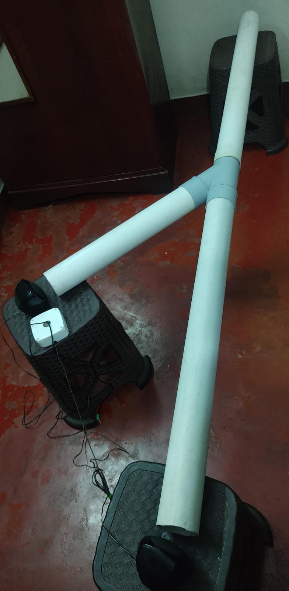
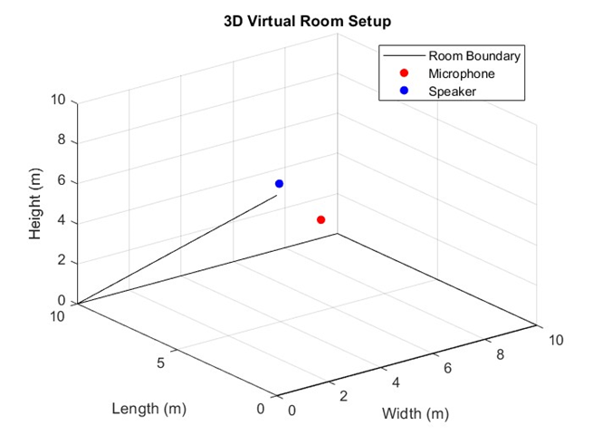
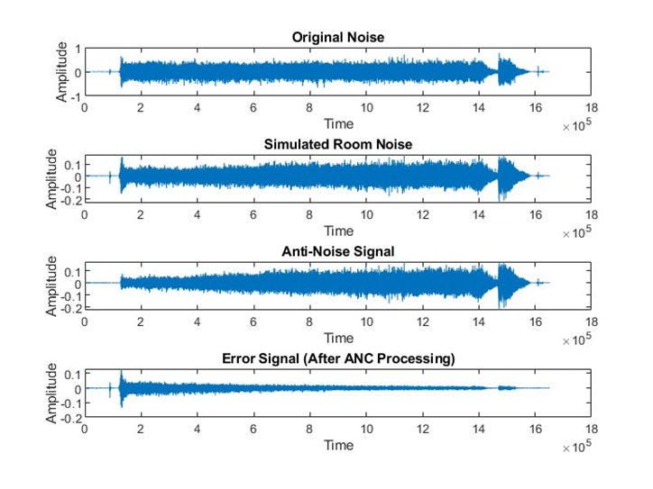
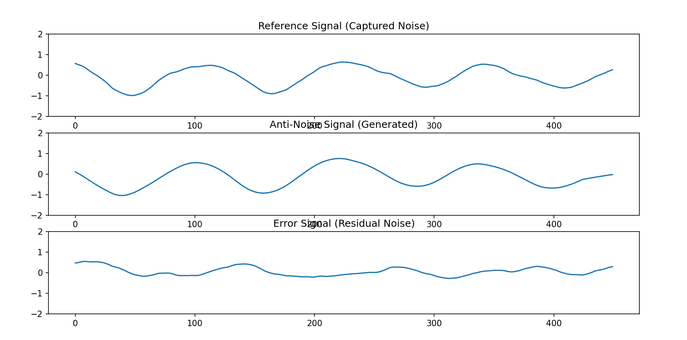

# Adaptive Noise Mitigation System for Noise Senitive Areas

## 📄 Abstract

This project implements an Active Noise Cancellation (ANC) system using the Least Mean Squares (LMS) algorithm and real-time audio processing in Python. A reference microphone captures the ambient noise, and an adaptive FIR filter generates an anti-noise signal to destructively interfere with it. An error microphone monitors the remaining noise to adaptively fine-tune the filter weights.

Even though ANC is complex to implement in physical setups due to delays, reflections, and cost constraints, it remains a promising and actively researched field. Our implementation highlights key challenges and gives insight into both the potential and limitations of real-world ANC systems.

We also submitted a technical paper based on this project to the National Power Conference held at Muthoot Institute of Technology & Science, Kochi.

## 🖼️ Project Setup

Setup includes a duct made of pvc with y joint provided in the midway,one reference microphone and one reference microphone, a speaker that generates noise and a speaker that generates anti-noise signal

We have used laptop as ANC controller to make the development more flexible. Complete details about the project has been provided in the report provided.

## 📊 Simulation Results (MATLAB)

We simulated the ANC system in a virtual room created in MATLAB. Simulation shows effective noise attenuation and algorithm convergence.

## 🎧 Real-Time Signals (Python)

Reference noise, generated anti-noise, and error signal visualized in real-time.

Kindly Refer to the detailed report for knowing the components used

## 📚 References
1. L. Burian and P. Fuchs, “A simple active noise control in acoustic duct,” in ´ Proceedings of the 2005 European Conference on Circuit Theory and Design, 2005., vol. 3, pp. III–265, IEEE, 2005.

2. H. M. Lee, Z. Wang, K. M. Lim, and H. P. Lee, “A review of active noise control applications on noise barrier in three-dimensional/open space: myths and challenges,” Fluctuation and Noise Letters, vol. 18, no. 04, p. 1930002, 2019

3. F. Aslan and R. Paurobally, “Modelling and simulation of active noise control in a small room,” Journal of Vibration and Control, vol. 24, no. 3, pp. 607–618, 2018. 

4. A. J. Hull, C. Radcliffe, and S. Southward, “Global active noise control of a one-dimensional acoustic duct using a feedback controller,” 1993.

## Contributors
Simulation and Research - @VishnuPS & @AmarnathKV(https://github.com/Amar-Ram2003)

Hardware Implementaion - @VyshnavPS(https://github.com/vyshneav) & @VyshnavSanthosh(https://github.com/VyshnavSanthosh)

